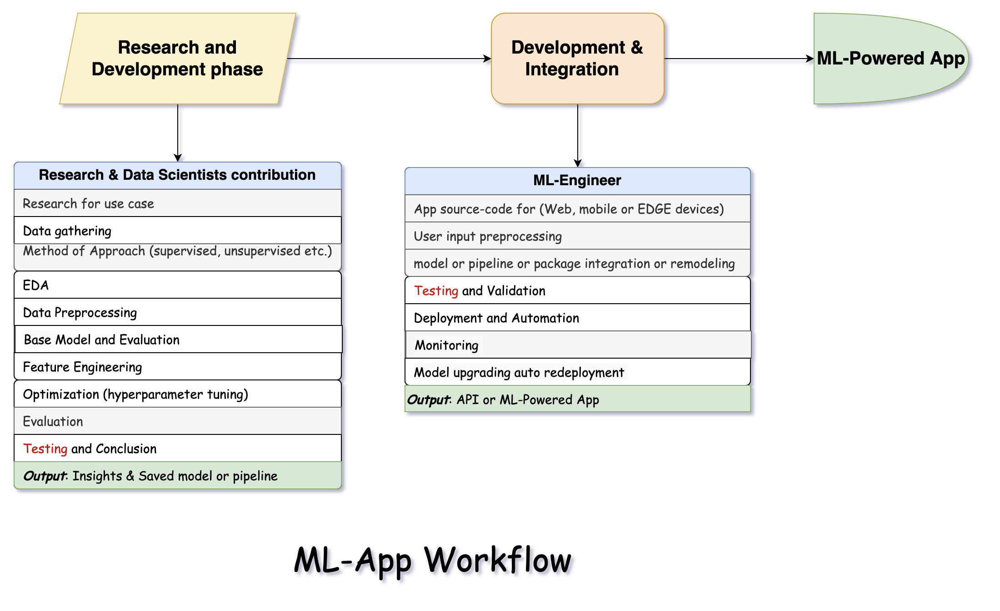

# TDD-in-MLOps
This repo is an approach to TDD in machine learning model operation. it covers project structure, testing essentials using pytest with Git automation and other latest tools in MLOps. 
